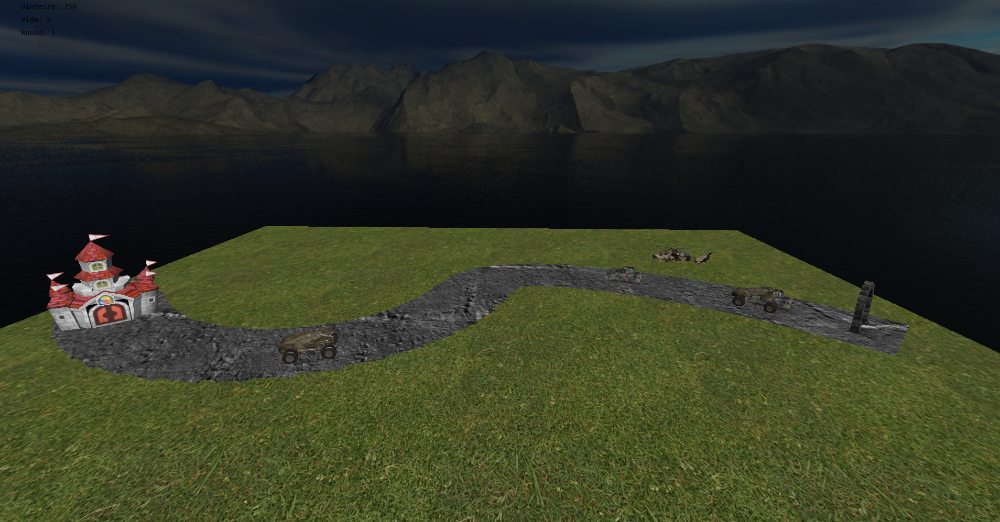
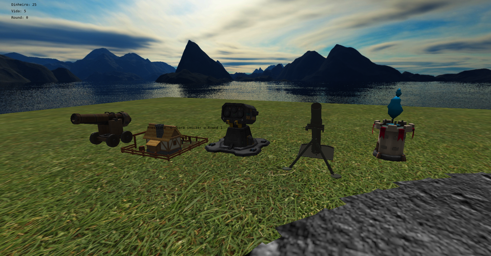

# Trabalho final de Fundamentos de Computação Gráfica
Implementamos um jogo no estilo Tower Defense, um gênero de estratégia em que o jogador deve posicionar estruturas defensivas ao longo de rotas predefinidas para impedir o avanço de inimigos. O desafio está em escolher estrategicamente diferentes tipos de torres, cada uma com características únicas, para conter ondas sucessivas de adversários cada vez mais fortes. O jogador também precisará administrar recursos limitados, que são adquiridos ao derrotar inimigos e evoluindo fazendas, para aprimorar ou construir novas torres, criando assim a dificuldade entre defesa eficiente e planejamento econômico.

## Componentes do grupo:
### Leonardo Nunes Ribeiro
- Implementação da curva de Bezier
- Implementação dos componentes de renderização

### Giovanni Cabreira Milanez
- Introdução dos modelos 3D e texturas utilizadas
- Implementação da lóglica do jogo

## Uso de ferramentas de inteligência artificial
O ChatGPT foi utilizado no processo de debugging da aplicação. A ferramenta foi úlil para esse propósito, mas não foi utilizada para o desenvolvimento do código.

## Descrição do programa
Uma curva de Bezier é utilizada para controlar o movimento dos inimigos e a exibição do seu caminho. No início da curva, de onde os inimigos aparecem, é posicionado um portal, e no fim é posicionado um castelo que serve como o ponto que o jogador deve defender.



O usuário deve posicionar torres que irão impedir os inimigos de alcançar o castelo.


Exceto a skybox, o indicador de alcançe das torres, o caminho dos inimigos e o chão, todos os objetos são iluminados usando o modelo Blinn-Phong. A quarta torre (morteiro) utiliza interpolação Gouraud, e o resto dos objetos usam interpolação Phong. Os objetos tem sua refletância difusa mapeada a partir de uma textura, e a refletância especular e a ambiente são definidas por objeto.

Colisões foram definidas para que a câmera não possa ultrapassar os limites do mapa ou entrar nos modelos das torres.

## Compilação e execução
### Na plataforma Linux
Com gcc e cmake instalados, execute o comando:
```
$ make
```
O executável resultante estará em `bin/Linux/main`. O programa pode ser executado usando o comando:
```
$ make run
```
### Na plataforma Windows
Com mingw e cmake instalados, abra o diretório do repositório no VIsual Studio Code.Instale as extensões "ms-vscode.cpptools" e "ms-vscode.cmake-tools. Na parte esquerda da barra inferior haverá um botão "Lauch" para compilar e executar o programa.

## Operação do programa
Para mudar a direção da câmera, segure o botão esquerdo e mova o mouse. As teclas WASD são utilizadas para mudar a posição da câmera livre.

Apertar o botão esquerdo do mouse em qualquer posição da tela seleciona essa posição. Caso nenhuma torre esteja presente nessa posição, o usuário pode apertar as teclas de números para gastar dinheiro e comprar uma torre nessa posição:
- Tecla 1: Torre de canhão
- Tecla 2: Fazenda
- Tecla 3: Torre de foguetes
- Tecla 4: Torre de morteiro
- Tecla 5: Torre de desaceleração

Caso exista uma torre nessa posição, ela é selecionada. O usuário então pode executar as seguintes interações:
- Tecla U: aprimora a torre, gastando dinheiro
- Tecla V: vende a torre, recuperando parte do dinheito gasto para comprá-la
- Tecla F: entra no modo de câmera da torre
- Tecla Q: muda o foco da torre
